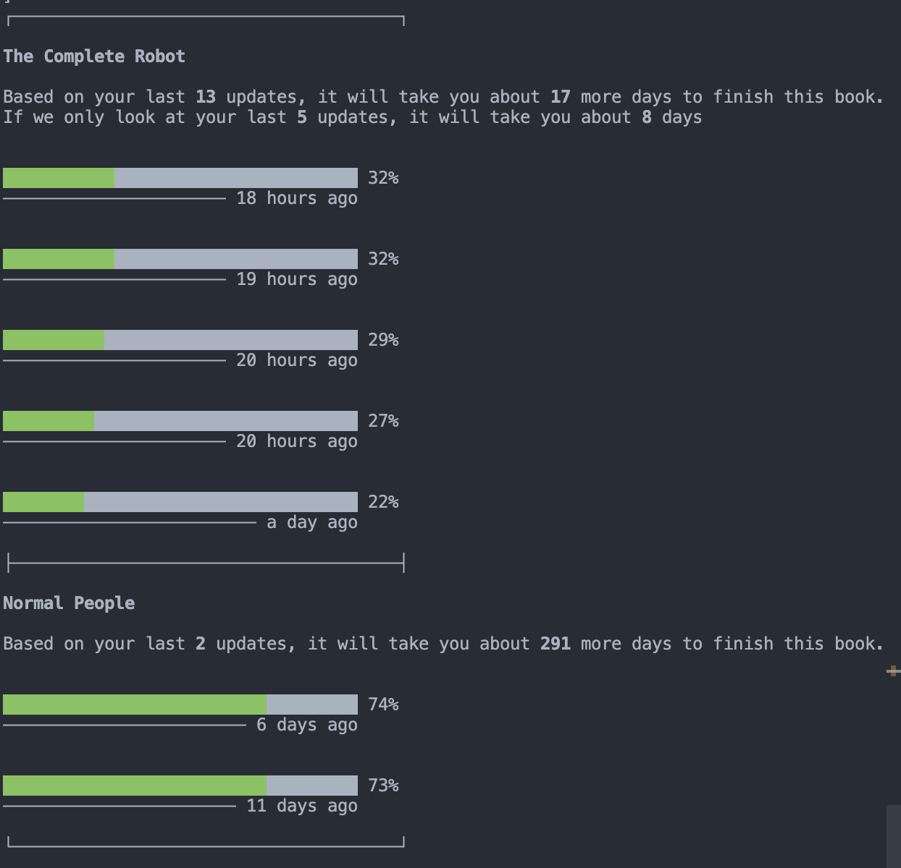

# GoodReads API & reading predictor

GoodReads does not have an official API anymore, so I built one. This repo includes both that API wrapper (with just a `get` method) and a tool that'll throw your "continue reading" at you and calculates how long it'll take to finish each book based on your latest updates

